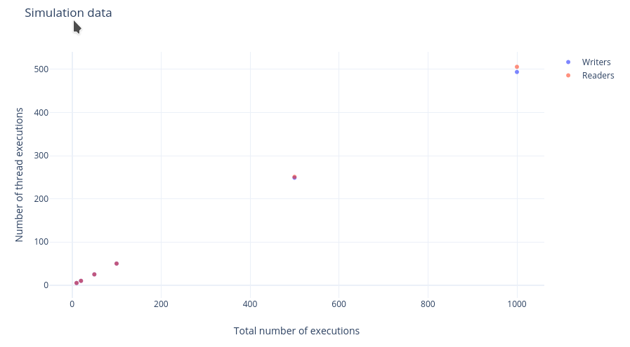

# Report:

## Experimental setup
 - Processor: Intel® Core™ i3-5005U × 4
 - Memory: 8GB
 - OS: Manjaro Linux
 - OS Type: 64-bit
 - Kernel: 5.15.78-1-MANJARO

## Additional information
 - The writers fill a part of the array with data that they generate randomly.
 - The readers compute the mean of a part of the array.
 - The maximum number of readers running simultaneously is 3.
 - The simulations were run with 5 readers and 5 writers.

## Simulation table
| **n**     | **Number of Read Executions** | **Number of Write Executions** |
|-----------|------------------------------:|-------------------------------:|
| **10**    |                             5 |                              5 |
| **20**    |                            10 |                             10 |
| **50**    |                            25 |                             25 |
| **100**   |                            50 |                             50 |
| **500**   |                           251 |                            249 |
| **1,000** |                           506 |                            494 |

## Graph

## Analysis
 - The number of read and write executions are almost identical.
 - As expected, when the array length increases, the read and write executions slightly stray away from the exact half of executions.
 - The implementation seems fair, assuming that we want the write and read operation to be executed with an equal priority (in other cases, one would want to execute more read than write operations).
 - The synchronization algorithm is still more efficient than a sequential algorithm since multiple readers read simultaneously.